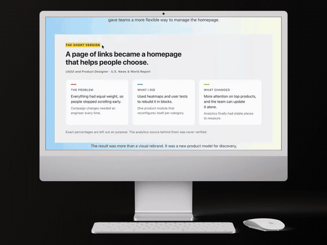

# The short version at the top of every case study



A recruiter gives your case study about 30 seconds before deciding whether to keep reading.

So I stopped making them earn it.

Every one of my 12 case studies now opens with a block called The short version. Three boxes, before any images, before any scrolling.

The problem. What I did. What changed.

Two lines each. That's the whole project. If that's all somebody reads, they still know what the work was and whether it went anywhere.

The long version is still underneath. The research, the wrong turns, the screens. But nobody has to dig through it to find out if the project's even relevant to them.

Here's the part I didn't expect.

Writing two lines for What changed is much harder than writing four paragraphs about process. Process writes itself. An outcome makes you admit whether anything actually moved.

On some projects it didn't, or the numbers were never verified. So the block says that out loud. Exact percentages are left out on purpose, because the analytics behind them was never confirmed.

A portfolio that quietly rounds numbers up is worth less than one that tells you which ones it doesn't trust.

If you want to do this to your own case studies, here's the prompt.

Go read the top of your own case study. Could a stranger tell you what it was in 30 seconds?

## The prompt

Copy it as it is and paste it into Claude, or any AI coding tool.

```text
Add a short summary block at the top of each of my case studies, before any images. Three parts: The problem, What I did, What changed. Two lines each, plain language, no jargon. Write it so someone who reads only this block still knows what the project was and whether it worked. Where I don't have a verified number for an outcome, say so in one line rather than leaving it vague or estimating.
```

**[Try the live demo](https://miguelclavel.github.io/portfolio-details/)** · **[Get the code: portfolio-details](https://github.com/miguelclavel/portfolio-details)** · [See it on miguelclavel.com](https://miguelclavel.com/?utm_source=github&utm_medium=recipes&utm_campaign=short-version)

<sub>[All recipes](../README.md) · By [Miguel Clavel](https://github.com/miguelclavel)</sub>
