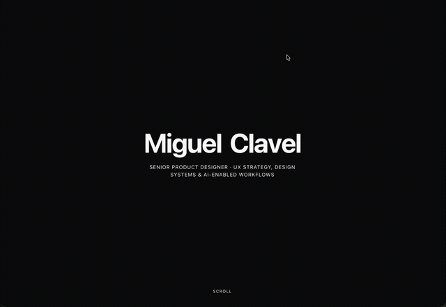

# A name that bursts into stickers when you click it



Click my name on my second portfolio and it explodes into stickers.

Every click spawns a handful of small shapes right where you clicked. Each one flies off in its own random direction, spins as it goes, gets pulled down like real gravity, and fades out over about a second. No two clicks throw the pieces the same way.

Here's a prompt that gets you the mechanic:

Small interaction, but it's the kind of thing that makes people click something twice just to watch it happen again.

## The prompt

Copy it as it is and paste it into Claude, or any AI coding tool.

```text
When an element is clicked, spawn a handful of small particles at the click position. Give each one a random direction and speed, a random spin, and a downward pull like gravity, so they arc instead of flying in a straight line. Fade each one out over about a second and remove it from the page once it's gone.
```

[See it on my second portfolio](https://miguelclavel-2.miguelclavel-1.workers.dev/?utm_source=github&utm_medium=recipes&utm_campaign=click-explode)

<sub>[All recipes](../README.md) · By [Miguel Clavel](https://github.com/miguelclavel)</sub>
