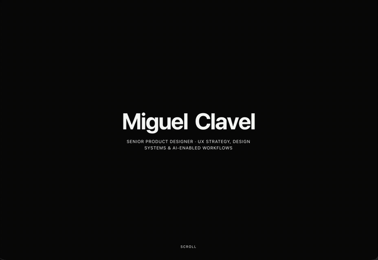

# A page that dissolves into the next section in pixel blocks



Scroll down my second portfolio and the whole page dissolves into the next section in pixel blocks, not a fade.

It's actually the same trick behind the dark and light mode toggle in my last post, just triggered by scroll position instead of a click. A grid of pixel blocks sweeps from bottom to top, mixing in a few accent colors along the way, tied directly to how far you've scrolled instead of running on a fixed timer.

Here's a prompt that gets you the underlying idea:

One mechanism, two different triggers. That's the kind of reuse I actually like finding in my own code.

## The prompt

Copy it as it is and paste it into Claude, or any AI coding tool.

```text
Transition between two sections of a page using a grid of solid color blocks instead of a fade. Tie the transition directly to scroll position, so it's not on a timer, sweep the blocks from bottom to top as the user scrolls through the range, and mix in two or three accent colors at a low percentage so it doesn't look like a flat wipe.
```

[See it on my second portfolio](https://miguelclavel-2.miguelclavel-1.workers.dev/?utm_source=github&utm_medium=recipes&utm_campaign=scroll-pixel-transition)

<sub>[All recipes](../README.md) · By [Miguel Clavel](https://github.com/miguelclavel)</sub>
