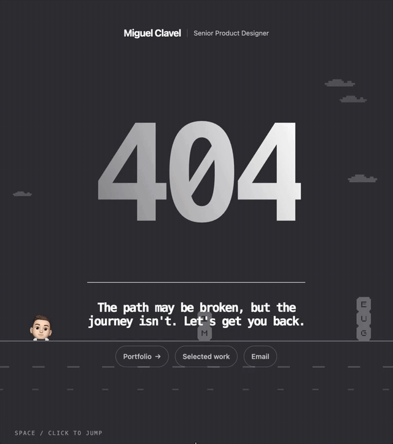
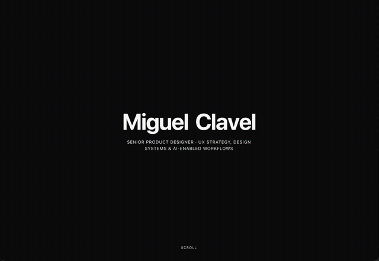

# Interaction recipes

A page can be completely correct and still feel flat. The gap between flat and expensive is usually a few small moments where the page notices you're there.

These are the small moments from my two portfolios, [miguelclavel.com](https://miguelclavel.com/?utm_source=github&utm_medium=recipes), each one written up the way I built it: what it does, what went wrong, and **the exact prompt**, so you can paste it into Claude or any AI coding tool and get it on your own site. Twelve of them also have their own repo with a live demo and plain, copyable code: [name-hover](https://github.com/miguelclavel/name-hover), [pixel-trail](https://github.com/miguelclavel/pixel-trail), [wave-line](https://github.com/miguelclavel/wave-line), [scroll-into-header](https://github.com/miguelclavel/scroll-into-header), [pixel-dissolve](https://github.com/miguelclavel/pixel-dissolve), [pixel-run-game](https://github.com/miguelclavel/pixel-run-game), [dark-mode](https://github.com/miguelclavel/dark-mode), [sticker-burst](https://github.com/miguelclavel/sticker-burst), [curve-carousel](https://github.com/miguelclavel/curve-carousel) and [portfolio-details](https://github.com/miguelclavel/portfolio-details) (the viewed badge, the short version and the selection colour). All of them are on one page at [miguelclavel.github.io](https://miguelclavel.github.io/). No libraries, no build step.

**[Try the live demos](https://miguelclavel.github.io/interaction-recipes/)** · By [Miguel Clavel](https://github.com/miguelclavel), Senior Product Designer

<table>
  <tr>
    <td width="50%" valign="top"> <b><a href="01-name-hover/">01 · A name where every letter reacts on its own</a></b> Eight hover animations, cycled so neighbours never match. Code: <a href="https://github.com/miguelclavel/name-hover">name-hover</a>.</td>
    <td width="50%" valign="top"> <b><a href="02-pixel-trail/">02 · A pixel trail behind the hero</a></b> A grid that remembers the brightest it's been, so the trail holds its shape. Code: <a href="https://github.com/miguelclavel/pixel-trail">pixel-trail</a>.</td>
  </tr>
  <tr>
    <td width="50%" valign="top"> <b><a href="03-wave-line/">03 · A line that bends toward your cursor</a></b> One control point, a spring that keeps 86% each bounce, no overlay. Code: <a href="https://github.com/miguelclavel/wave-line">wave-line</a>.</td>
    <td width="50%" valign="top"> <b><a href="04-scroll-into-header/">04 · A name that travels into the header</a></b> One scroll number from 0 to 1 drives everything, through an easing curve. Code: <a href="https://github.com/miguelclavel/scroll-into-header">scroll-into-header</a>.</td>
  </tr>
  <tr>
    <td width="50%" valign="top"> <b><a href="05-cards-from-sides/">05 · Screenshots that fly in from both sides</a></b> Why the first version looked like a slideshow, and what fixed it.</td>
    <td width="50%" valign="top"> <b><a href="06-images-frame-text/">06 · Images that turn into the frame for the text</a></b> Images placed around an invisible circle, leaving the centre clear.</td>
  </tr>
  <tr>
    <td width="50%" valign="top"> <b><a href="07-pixel-dissolve/">07 · A pixel dissolve from light into dark</a></b> Two thirds order, one third noise. Took four tries. Code: <a href="https://github.com/miguelclavel/pixel-dissolve">pixel-dissolve</a>.</td>
    <td width="50%" valign="top"> <b><a href="08-footer-game/">08 · A playable game in the footer</a></b> The thing you jump over is my own name. Full code in <a href="https://github.com/miguelclavel/pixel-run-game">pixel-run-game</a>.</td>
  </tr>
  <tr>
    <td width="50%" valign="top"> <b><a href="09-case-study-carousel/">09 · Case studies that ride a curve</a></b> Cards on a circle whose centre sits below the screen. Code: <a href="https://github.com/miguelclavel/curve-carousel">curve-carousel</a>.</td>
    <td width="50%" valign="top"> <b><a href="10-selection-colour/">10 · A text selection colour that belongs to the brand</a></b> The smallest detail on the site, and the one people notice. Code: <a href="https://github.com/miguelclavel/portfolio-details">portfolio-details</a>.</td>
  </tr>
</table>

## More recipes

<table>
  <tr>
    <td width="50%" valign="top"><b><a href="11-viewed-badge/">11 · A case study list that remembers what you opened</a></b> A small "viewed" mark, kept for the visit only, so readers know where they have been. Code: <a href="https://github.com/miguelclavel/portfolio-details">portfolio-details</a>.</td>
    <td width="50%" valign="top"> <b><a href="12-short-version/">12 · The short version at the top of every case study</a></b> The problem, what I did, what changed, before any images. For the 30 second read. Code: <a href="https://github.com/miguelclavel/portfolio-details">portfolio-details</a>.</td>
  </tr>
  <tr>
    <td width="50%" valign="top"> <b><a href="13-dark-light/">13 · A dark mode that remembers you</a></b> A toggle that sticks across visits, and starts from the visitor's own system setting. Code: <a href="https://github.com/miguelclavel/dark-mode">dark-mode</a>.</td>
    <td width="50%" valign="top"> <b><a href="14-404-page-game/">14 · A 404 game that never hands you an impossible jump</a></b> Obstacles that stay fair as the game speeds up.</td>
  </tr>
  <tr>
    <td width="50%" valign="top"> <b><a href="15-pixel-name-fill/">15 · A name that fills in with colour, pixel by pixel</a></b> Like an old dot matrix printer catching up to itself. From my second portfolio.</td>
    <td width="50%" valign="top"> <b><a href="16-click-explode/">16 · A name that bursts into stickers when you click it</a></b> A handful of particles with their own speed, spin and fall. From my second portfolio. Code: <a href="https://github.com/miguelclavel/sticker-burst">sticker-burst</a>.</td>
  </tr>
  <tr>
    <td width="50%" valign="top"> <b><a href="17-scroll-pixel-transition/">17 · A page that dissolves into the next section in pixel blocks</a></b> Blocks instead of a fade, tied to scroll. From my second portfolio.</td>
    <td width="50%" valign="top"></td>
  </tr>
</table>

## Fixes worth stealing

Not every recipe is a flourish. These three are the bugs I found in my own sites, written up the same way, with a prompt that fixes yours.

- **[18 · An animation that worked hard to change nothing](18-scroll-performance-audit/)**: 150 frames of work every 2.5 seconds, for a section nobody was looking at.
- **[19 · The page that kept requesting a file called {{g.src}}](19-404-template-hole/)**: a template placeholder the browser fetched before the page filled it in.
- **[20 · The keyboard support that crashed every time it ran](20-accessibility-crash/)**: accessibility code that assumed something the runtime never passed it.

## How to use a recipe

1. Open the recipe and watch the recording, so you know what you're aiming for.
2. Copy the prompt as it is and paste it into Claude, Claude Code, or any AI coding tool, along with your page.
3. Tune it. Every recipe says which number to play with.

For the ones with their own repo, you can also take the code straight from it. Each one is a single file.

## Why prompts and not just code

Because the decisions are the useful part. Each write up says what I got wrong before it worked: the letters that kept firing while the name was moving, the squares that lit up under the text, the dissolve that finished before anyone could see it. A prompt that carries those decisions gets you further than a snippet that doesn't.

If you build one of these, send it to me. I'd genuinely like to see it.

---

MIT licensed. Made by [Miguel Clavel](https://miguelclavel.com/?utm_source=github&utm_medium=recipes) with Claude Code. Also on [LinkedIn](https://www.linkedin.com/in/miguelclavel/).
