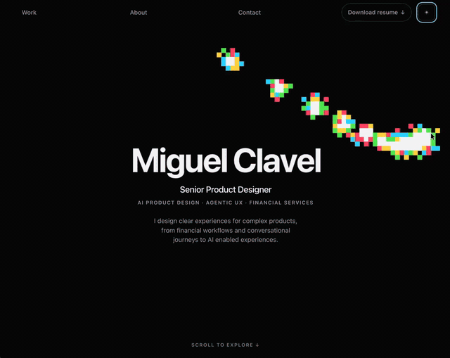
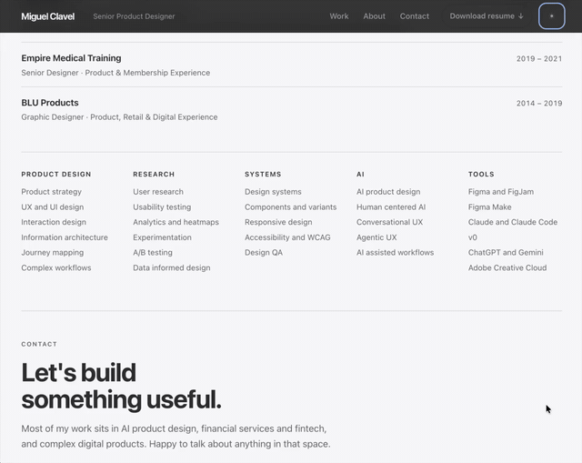
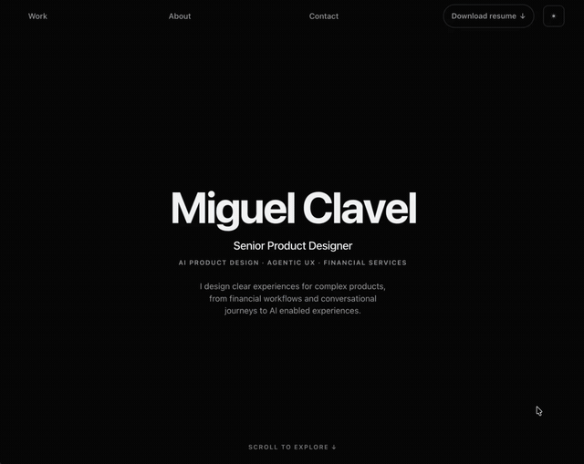
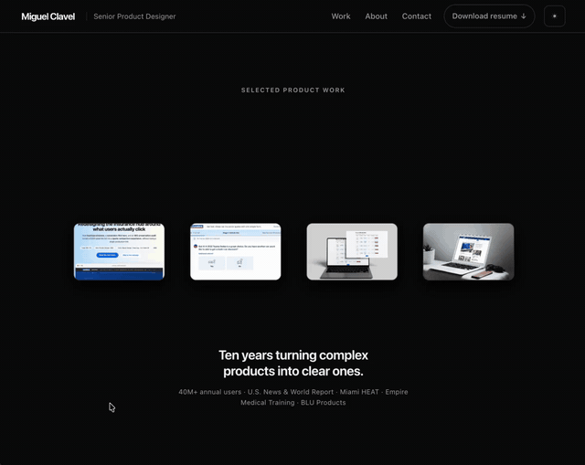
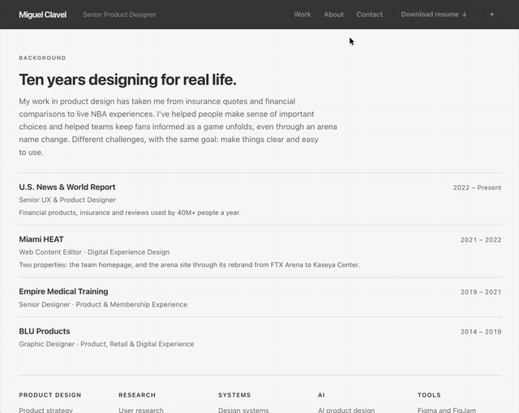

# Interaction recipes

A page can be completely correct and still feel flat. The gap between flat and expensive is usually a few small moments where the page notices you're there.

These are the small moments from my portfolio, [miguelclavel.com](https://miguelclavel.com/?utm_source=github&utm_medium=recipes), each one written up the way I built it: what it does, what went wrong, and **the exact prompt**, so you can paste it into Claude or any AI coding tool and get it on your own site. Three of them also have a live demo with plain, copyable code. No libraries, no build step.

**[Try the live demos](https://miguelclavel.github.io/interaction-recipes/)** · By [Miguel Clavel](https://github.com/miguelclavel), Senior Product Designer

<table>
  <tr>
    <td width="50%" valign="top"> <b><a href="01-name-hover/">01 · A name where every letter reacts on its own</a></b> Eight hover animations, cycled so neighbours never match. Live demo.</td>
    <td width="50%" valign="top"> <b><a href="02-pixel-trail/">02 · A pixel trail behind the hero</a></b> A grid that remembers the brightest it's been, so the trail holds its shape. Live demo.</td>
  </tr>
  <tr>
    <td width="50%" valign="top"> <b><a href="03-wave-line/">03 · A line that bends toward your cursor</a></b> One control point, a spring that keeps 86% each bounce, no overlay. Live demo.</td>
    <td width="50%" valign="top"> <b><a href="04-scroll-into-header/">04 · A name that travels into the header</a></b> One scroll number from 0 to 1 drives everything, through an easing curve.</td>
  </tr>
  <tr>
    <td width="50%" valign="top"> <b><a href="05-cards-from-sides/">05 · Screenshots that fly in from both sides</a></b> Why the first version looked like a slideshow, and what fixed it.</td>
    <td width="50%" valign="top"> <b><a href="06-images-frame-text/">06 · Images that turn into the frame for the text</a></b> Images placed around an invisible circle, leaving the centre clear.</td>
  </tr>
  <tr>
    <td width="50%" valign="top"><b><a href="07-pixel-dissolve/">07 · A pixel dissolve from light into dark</a></b> Two thirds order, one third noise. Took four tries.</td>
    <td width="50%" valign="top"> <b><a href="08-footer-game/">08 · A playable game in the footer</a></b> The thing you jump over is my own name. Full code in <a href="https://github.com/miguelclavel/pixel-run-game">pixel-run-game</a>.</td>
  </tr>
  <tr>
    <td width="50%" valign="top"> <b><a href="09-case-study-carousel/">09 · Case studies that ride a curve</a></b> Cards on a circle whose centre sits below the screen.</td>
    <td width="50%" valign="top"> <b><a href="10-selection-colour/">10 · A text selection colour that belongs to the brand</a></b> The smallest detail on the site, and the one people notice.</td>
  </tr>
</table>

## How to use a recipe

1. Open the recipe and watch the recording, so you know what you're aiming for.
2. Copy the prompt as it is and paste it into Claude, Claude Code, or any AI coding tool, along with your page.
3. Tune it. Every recipe says which number to play with.

For the three with live demos, you can also take the code straight from `index.html` in the folder. Each one is a single file.

## Why prompts and not just code

Because the decisions are the useful part. Each write up says what I got wrong before it worked: the letters that kept firing while the name was moving, the squares that lit up under the text, the dissolve that finished before anyone could see it. A prompt that carries those decisions gets you further than a snippet that doesn't.

If you build one of these, send it to me. I'd genuinely like to see it.

---

MIT licensed. Made by [Miguel Clavel](https://miguelclavel.com/?utm_source=github&utm_medium=recipes) with Claude Code. Also on [LinkedIn](https://www.linkedin.com/in/miguelclavel/).
